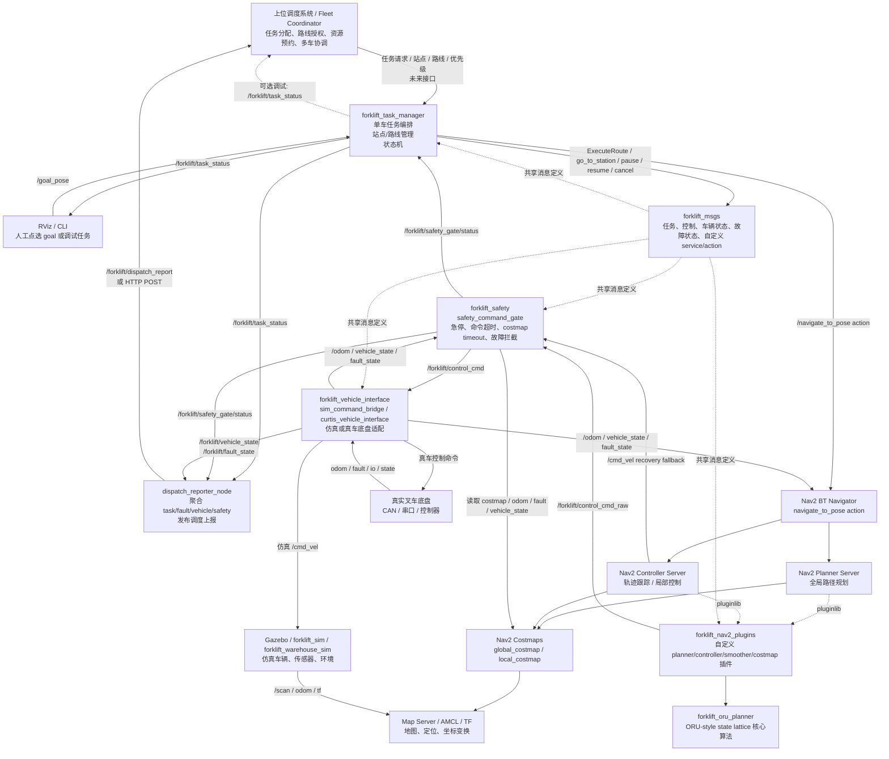
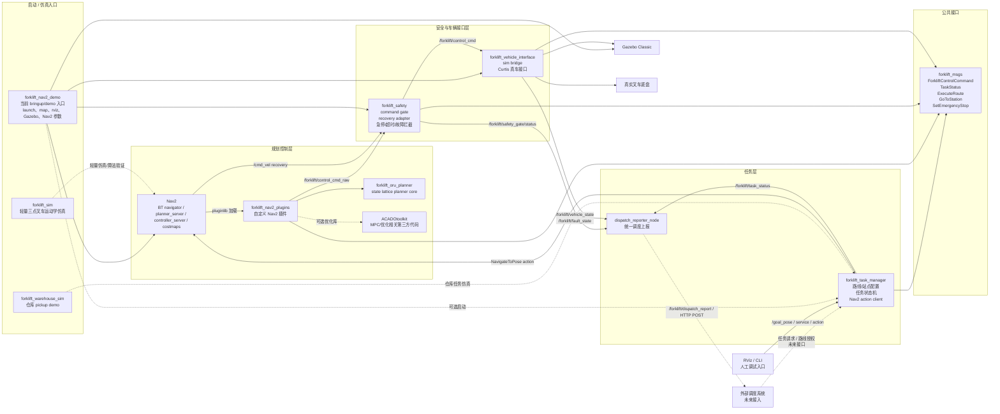
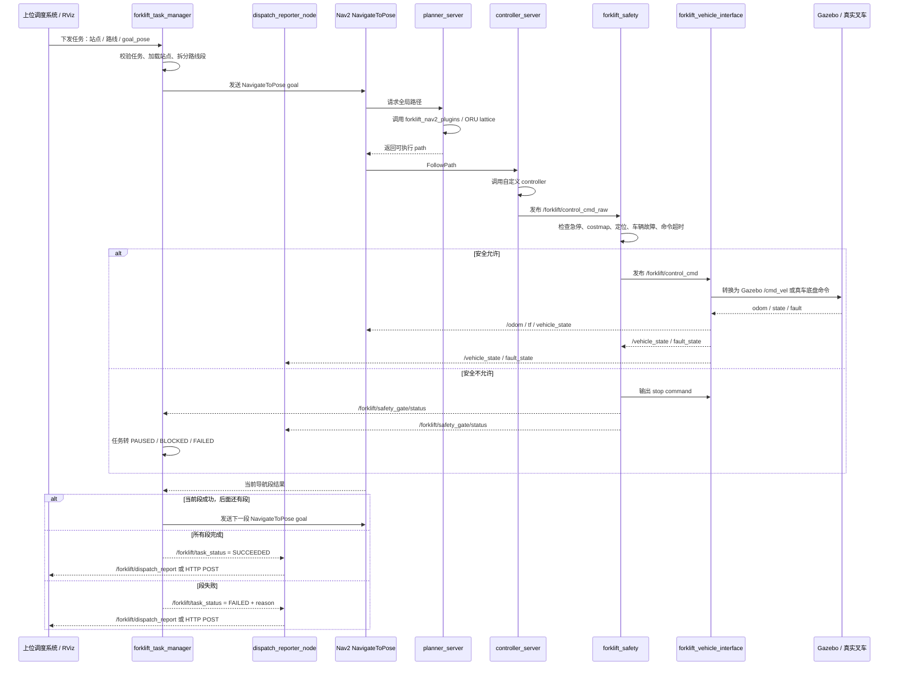
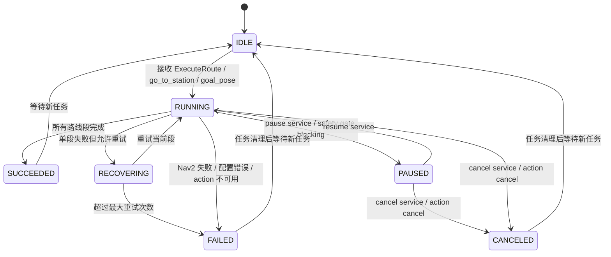

# Task Manager、调度系统与规划控制流程图

本文档描述当前 forklift 项目里 Task Manager、调度系统、Nav2 规划控制、安全层、车辆接口和各 package 之间的关系。

当前结论：

- 调度系统负责“分配任务、授权路线、协调多车资源”。
- `forklift_task_manager` 负责“单车任务编排、状态维护、分段执行、失败上报”。
- `forklift_task_manager.dispatch_reporter_node` 负责“聚合任务、故障、车辆和 safety 状态，形成调度上报报文”。
- Nav2 负责“路径规划、行为树调度、局部控制、costmap、定位地图服务”。
- `forklift_nav2_plugins` / `forklift_oru_planner` 负责“叉车运动学约束下的规划和控制算法”。
- `forklift_safety` 负责“所有运动命令的最终安全拦截”。
- `forklift_vehicle_interface` 负责“把安全后的控制命令转成仿真或真车底盘命令”。
- `forklift_nav2_demo` 目前承担 bringup/demo 职责，统一启动 Gazebo、RViz、Nav2、safety、vehicle bridge 等节点。

## 1. 整体运行流程



### 关键原则

1. 调度系统不直接发 `/cmd_vel`，也不直接控制底盘。
2. Task Manager 不直接发 `/cmd_vel` 或 CAN 指令，只调用 Nav2 action 和车辆业务动作。
3. Planner / Controller 只负责算路径和控制命令，不负责业务任务状态。
4. 所有运动命令最终都要经过 `forklift_safety`，不能绕过 safety gate。
5. `forklift_vehicle_interface` 只做底盘适配和状态反馈，不写任务逻辑。

## 2. 当前 package 关系图



## 3. 单车任务执行流程



## 4. Task Manager 状态流转



当前实现里，Task Manager 已经有最小状态机和以下入口：

- action：`execute_route`
- service：`go_to_station`
- service：`pause`
- service：`resume`
- service：`cancel`
- topic 输入：`/goal_pose`
- topic 输入：`/forklift/safety_gate/status`
- topic 输出：`/forklift/task_status`
- Nav2 action client：`navigate_to_pose`

当前 `task_manager.launch.py` 默认也启动 `dispatch_reporter_node`。它不发运动命令，只聚合以下输入：

- `/forklift/task_status`：任务状态，由 `forklift_task_manager` 发布。
- `/forklift/fault_state`：底盘故障状态，由 `forklift_vehicle_interface` 发布。
- `/forklift/vehicle_state`：车辆运行状态和 `battery_percent`，由 `forklift_vehicle_interface` 发布。
- `/forklift/safety_gate/status`：最终安全闸状态，由 `forklift_safety` 发布。

它默认输出 `/forklift/dispatch_report`（`std_msgs/String`，内容是 JSON），可选配置 `dispatch_http_url` 后同时 HTTP POST 到调度系统。

## 5. 职责划分表

| 模块 / package | 当前职责 | 不应该负责 |
| --- | --- | --- |
| 外部调度系统 | 多车任务分配、路线授权、资源预约、优先级、死锁/会车策略 | 直接发 `/cmd_vel`、直接控制 CAN、绕过车端 safety |
| `forklift_task_manager` | 单车任务编排、站点/路线管理、分段执行、暂停/恢复/取消、任务状态发布；`dispatch_reporter_node` 聚合调度上报 | 底盘控制、路径算法、局部避障算法、急停执行 |
| Nav2 | lifecycle、BT navigator、planner/controller/costmap/map server/AMCL | 调度业务、多车资源协调、底盘协议 |
| `forklift_nav2_plugins` | 自定义全局规划、局部控制、平滑、costmap 插件 | 任务队列、调度接口、真车通信 |
| `forklift_oru_planner` | ORU-style state lattice 规划核心算法 | ROS bringup、任务状态、底盘协议 |
| `forklift_safety` | safety gate、急停、命令超时、costmap 超时、故障拦截、recovery adapter | 路线调度、业务任务编排、地图站点管理 |
| `forklift_vehicle_interface` | 仿真 bridge、真车 Curtis 接口、车辆状态/故障/里程计反馈 | 任务决策、路径规划、安全策略决策 |
| `forklift_msgs` | 自定义 msg/srv/action 公共接口 | 节点运行逻辑 |
| `forklift_nav2_demo` | 当前仿真/真车 bringup 入口、地图、RViz、Gazebo、Nav2 参数 | 长期不应承载全部业务逻辑，后续可拆成 bringup/navigation/description |
| `forklift_sim` | 轻量三点叉车运动学仿真 | 真实 Gazebo 场景和完整系统 bringup |
| `forklift_warehouse_sim` | 仓库 pickup demo 和场景验证 | 调度系统主体 |
| `ACADOtoolkit` | 优化/MPC 相关第三方库 | ROS 任务状态和车辆接口 |

## 6. 后续接调度系统建议接口

第一版调度接入不要直接做复杂多车协议，建议先定义单车任务接口：

```text
调度系统 -> forklift_task_manager:
  task_id
  task_type: go_to_station / execute_route / park / charge / pickup / dropoff
  target_station
  route_name
  priority
  allowed_resources
  timestamp

dispatch_reporter_node -> 调度系统:
  task_id            # 后续接真实调度任务 ID 时补入
  state: IDLE / RUNNING / PAUSED / BLOCKED / FAILED / SUCCEEDED / CANCELED
  active_route
  current_segment
  progress
  failure_reason
  robot_pose         # 后续由定位/TF 聚合补入
  safety_status
  vehicle_state
  fault_state
  alarms
```

当前 `dispatch_reporter_node` 已实现 `state`、`active_route`、`current_segment`、
`failure_reason`、`safety_status`、`vehicle_state`、`fault_state` 和 `alarms`；
`task_id`、`progress`、`robot_pose` 属于接真实调度协议时的下一步字段。

后续扩展多车时，调度系统可以增加 resource lease、route reservation、intersection permission、reroute decision 等字段，但仍然保持一个原则：调度系统授权路线和资源，车端 Task Manager 执行任务，底层运动命令必须经过 Safety Gate。

## 7. 当前 Dispatch Reporter 实现

新增节点：

```bash
ros2 run forklift_task_manager dispatch_reporter_node
```

或随任务管理器启动：

```bash
ros2 launch forklift_task_manager task_manager.launch.py
```

常用 launch 参数：

```text
use_dispatch_reporter:=true
robot_id:=forklift_001
dispatch_report_topic:=/forklift/dispatch_report
dispatch_http_url:=
battery_low_threshold:=20.0
```

默认只发布 ROS 话题，不主动访问外部调度系统。配置 `dispatch_http_url` 后，每个报告周期会把同一份 JSON 以 `Content-Type: application/json` POST 到该 URL。

`/forklift/dispatch_report` 示例结构：

```json
{
  "robot_id": "forklift_001",
  "task": {
    "available": true,
    "state": "PAUSED",
    "active_route": "route_a",
    "current_segment": "station_b",
    "segment_index": 1,
    "segment_count": 3,
    "reason": "vehicle fault"
  },
  "fault": {
    "available": true,
    "has_fault": true,
    "summary": "left_drive=7",
    "left_drive_fault_code": 7,
    "right_drive_fault_code": 0,
    "steering_fault_code": 0,
    "lift_fault_code": 0
  },
  "vehicle": {
    "available": true,
    "battery_percent": 12.5,
    "enabled": true,
    "auto_mode": true,
    "emergency_stopped": false,
    "soft_emergency_stop": false,
    "parking_brake": false,
    "interlock": true,
    "mode": "auto",
    "velocity_mps": 0.0
  },
  "safety_status": "vehicle fault",
  "alarms": [
    {"level": "ERROR", "code": "VEHICLE_FAULT", "message": "left_drive=7"},
    {"level": "WARN", "code": "LOW_BATTERY", "message": "battery 12.5% <= 20.0%"}
  ]
}
```

调度系统第一版推荐消费 `/forklift/dispatch_report`；排障时再直接 echo 原始话题：

```bash
ros2 topic echo /forklift/task_status
ros2 topic echo /forklift/fault_state
ros2 topic echo /forklift/vehicle_state
ros2 topic echo /forklift/safety_gate/status
```
