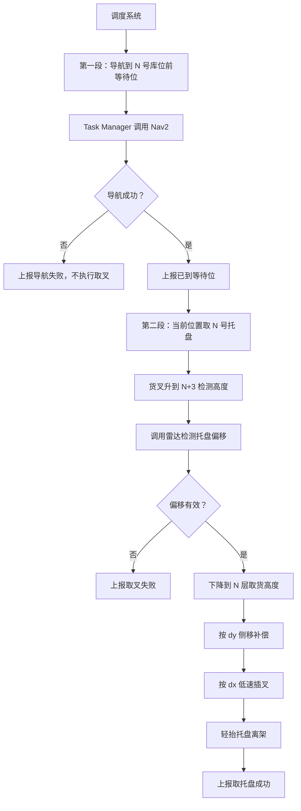

# 两段式 N 号库位取托盘任务逻辑设计文档

建议文件名：`two_stage_pallet_pickup_task.md`

## 1. 背景

当前 `forklift_task_manager` 已具备基础任务编排能力，可以接收调度或人工指令，调用 Nav2 完成点到点导航，并通过 `/forklift/task_status` 上报任务状态。

现在需要新增一个“到 N 号库位取托盘”的业务流程。根据现场流程，车辆到达目标库位前后，不能直接下降到 N 层插叉，而是需要先将叉臂升到 `N+3` 的高度，方便雷达识别托盘位置；雷达输出托盘相对车体的前后偏移和横向偏移后，再下降到 N 层取货高度，并根据偏移量完成对准和插叉。

为了便于现场调试、异常恢复和模块解耦，本方案采用“两段式任务”设计。

## 2. 设计目标

目标是将完整取托盘流程拆成两个独立任务：

1. **导航段**：车辆从当前位置导航到 N 号库位前等待位。
2. **取叉段**：车辆已在等待位后，执行升叉、雷达检测、下降、偏移补偿和插叉。

这样可以保证：

- 导航失败不会触发货叉动作。
- 取叉失败后可以在当前位置单独重跑取叉段。
- 雷达、货叉、低速插叉逻辑可以独立调试。
- 调度系统可以清楚知道车辆当前处于“到位前”还是“正在取叉”。

## 3. 总体流程



## 4. 第一段：导航到库位前等待位

第一段只负责车辆移动到目标库位前的安全等待位，不做任何货叉、雷达或插叉动作。

推荐沿用当前已有接口：

- `go_to_station(slot_N_approach)`
- 或 `execute_route(route_to_slot_N_approach)`

成功标准：

- Nav2 返回成功。
- 车辆到达 `slot_N_approach`。
- Task Manager 上报 `SUCCEEDED`。
- 不自动进入第二段。

失败处理：

- Nav2 action 不可用：任务失败。
- 路径规划失败：按现有 `max_retries` 重试。
- safety gate 触发：任务暂停。
- 超过重试次数：上报导航失败。

## 5. 第二段：当前位置取托盘

第二段假设车辆已经停在 N 号库位前等待位附近。Task Manager 不再执行大范围导航，只编排货叉、雷达和短距离插叉动作。

第二段状态建议如下：

```text
WAIT_READY
RAISE_TO_SCAN_HEIGHT
DETECT_OFFSET
VALIDATE_OFFSET
LOWER_TO_PICK_HEIGHT
APPLY_LATERAL_OFFSET
INSERT_FORK
LIFT_CLEARANCE
SUCCEEDED / FAILED / PAUSED / CANCELED
```

具体流程：

1. `WAIT_READY`
   - 确认没有导航任务正在运行。
   - 确认车辆速度为 0。
   - 确认 safety gate 正常。
   - 确认货叉控制和雷达接口可用。

2. `RAISE_TO_SCAN_HEIGHT`
   - 目标取货高度为 `H_pick`。
   - 雷达检测高度为 `H_scan = H_pick + 3 * level_pitch_m`。
   - 调用货叉 action，将叉臂升到检测高度。

3. `DETECT_OFFSET`
   - 调用雷达检测 action。
   - 雷达输出托盘相对车辆坐标系的偏移：
     - `dx`：前后偏移。
     - `dy`：横向偏移。
     - `confidence`：识别置信度。

4. `VALIDATE_OFFSET`
   - 检查雷达是否超时。
   - 检查置信度是否达标。
   - 检查 `abs(dx)` 是否小于最大允许前后偏移。
   - 检查 `abs(dy)` 是否小于最大允许横向偏移。
   - 偏移无效时立即失败，不执行插叉。

5. `LOWER_TO_PICK_HEIGHT`
   - 货叉从 `N+3` 检测高度下降到 N 层取货高度 `H_pick`。

6. `APPLY_LATERAL_OFFSET`
   - 使用侧移机构补偿横向偏移 `dy`。
   - 如果 `dy` 超过侧移能力，任务失败。

7. `INSERT_FORK`
   - 按 `dx + fork_insert_depth_m` 执行低速短距离插叉。
   - 低速运动仍必须经过 safety gate。
   - Task Manager 不直接发 CAN 或绕过底层安全链路。

8. `LIFT_CLEARANCE`
   - 插叉完成后，货叉轻抬 `pallet_clearance_m`。
   - 托盘离架后，第二段任务成功。

## 6. 推荐 ROS 接口

### 6.1 取叉任务 Action

新增 action：`ExecutePalletPickup.action`

```text
# Goal
string task_id
string slot_id

---
# Result
bool success
string message
float64 offset_x_m
float64 offset_y_m

---
# Feedback
string phase
float32 progress
float64 current_height_m
```

说明：

- `slot_id` 表示 N 号库位。
- `phase` 用于上报当前处于升叉、检测、下降、侧移、插叉等阶段。
- `offset_x_m`、`offset_y_m` 记录雷达检测结果，便于调试和追溯。

### 6.2 货叉控制 Action

建议抽象为“到目标货叉姿态”，而不是由 Task Manager 直接控制阀电流。

```text
ForkMoveTo.action

# Goal
float64 target_height_m
float64 side_shift_m
float64 tilt_rad

---
# Result
bool success
string message
float64 final_height_m

---
# Feedback
float64 current_height_m
string phase
```

### 6.3 雷达检测 Action

```text
DetectPalletOffset.action

# Goal
string slot_id
float64 scan_height_m

---
# Result
bool success
string message
float64 offset_x_m
float64 offset_y_m
float64 confidence

---
# Feedback
string phase
```

### 6.4 低速相对运动 Action

```text
MoveRelative.action

# Goal
float64 distance_m
float64 max_speed_mps

---
# Result
bool success
string message

---
# Feedback
float64 remaining_distance_m
```

## 7. 配置项

建议新增库位配置文件，例如 `pallet_slots.yaml`：

```yaml
slots:
  slot_001:
    approach_station: slot_001_approach
    level_index: 1
    pick_height_m: 0.55

  slot_002:
    approach_station: slot_002_approach
    level_index: 2
    pick_height_m: 1.10

pickup_defaults:
  level_pitch_m: 0.55
  scan_level_offset: 3
  fork_insert_depth_m: 0.80
  pallet_clearance_m: 0.08
  max_offset_x_m: 0.20
  max_offset_y_m: 0.08
  min_detection_confidence: 0.75
  fork_timeout_sec: 8.0
  detection_timeout_sec: 3.0
  fine_motion_timeout_sec: 6.0
  fine_motion_speed_mps: 0.08
```

高度计算规则：

```text
H_pick = pick_height_m
H_scan = H_pick + scan_level_offset * level_pitch_m
```

默认 `scan_level_offset = 3`，即检测高度为 `N+3`。

## 8. 异常处理

| 异常 | 处理 |
| --- | --- |
| 导航失败 | 第一段失败，不进入取叉段 |
| 车辆未到等待位就请求取叉 | 拒绝第二段任务 |
| 货叉升到 N+3 超时 | 第二段失败，上报货叉超时 |
| 雷达无结果 | 第二段失败，不下降插叉 |
| 雷达置信度不足 | 第二段失败 |
| `dx` 超限 | 第二段失败，提示前后偏移过大 |
| `dy` 超限 | 第二段失败，提示横向偏移过大 |
| 侧移失败 | 第二段失败 |
| 插叉过程中 safety gate 触发 | 暂停当前动作 |
| 用户取消任务 | 停止当前动作，任务回到 IDLE |

## 9. Task Manager 职责边界

Task Manager 负责：

- 接收调度任务。
- 编排导航段和取叉段。
- 管理任务状态。
- 调用 Nav2、货叉、雷达、低速相对运动 action。
- 发布 `/forklift/task_status`。
- 将失败原因清楚上报给调度系统。

Task Manager 不负责：

- 直接发布 `/cmd_vel`。
- 直接发布 CAN 指令。
- 直接控制货叉阀电流。
- 实现雷达识别算法。
- 绕过 `forklift_safety` 执行底盘运动。

## 10. 测试计划

单元测试：

- 正常导航到等待位。
- 导航失败后不触发取叉。
- 取叉正常流程：升到 N+3、检测、下降到 N、侧移、插叉、抬升。
- 雷达 timeout。
- 雷达置信度不足。
- `dx` 超限。
- `dy` 超限。
- 货叉 action 失败。
- 低速插叉 action 失败。
- pause / resume / cancel。

节点级测试：

- mock Nav2 action server。
- mock 货叉 action server。
- mock 雷达 action server。
- mock 低速相对运动 action server。
- 校验第二段不会调用 Nav2。
- 校验第一段成功后不会自动进入第二段。
- 校验 `/forklift/task_status.reason` 包含明确失败原因。

现场联调测试：

- 空库位测试：雷达应返回无托盘，任务失败。
- 正常托盘测试：任务完成插叉和轻抬。
- 人为制造横向偏移：验证侧移补偿。
- 人为制造超限偏移：验证任务拒绝插叉。
- 急停测试：验证任务暂停且底盘/货叉停止。

## 11. 默认假设

- 调度系统先下发第一段导航任务。
- 第一段成功后，调度系统或人工确认再下发第二段取叉任务。
- 第二段开始时车辆已经停在库位前等待位附近。
- `dx`、`dy` 坐标方向由雷达节点统一定义，并在接口文档中固定。
- 所有底盘运动仍经过 `forklift_safety`。
- 货叉动作由独立货叉控制节点闭环完成，Task Manager 只调用目标动作。
